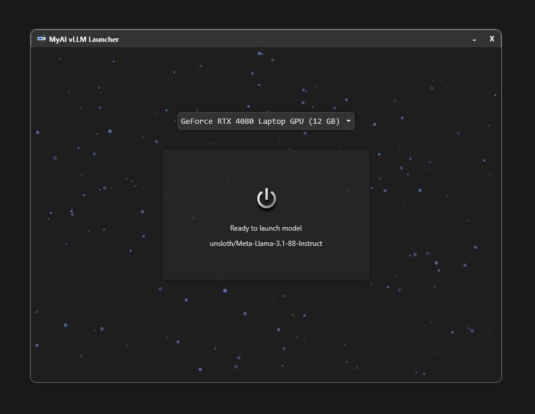

# MyAI vLLM Model Launcher

#### Hybrid Mode (Server + Client)


A user-friendly PowerShell script for launching and interacting with AI models using [vLLM](https://github.com/vllm-project/vllm) on Windows. It supports a hybrid client-server mode (running the server in WSL with CUDA acceleration) or client-only mode (connecting to a remote vLLM server). The script features a modern WPF-based GUI with automatic dependency installation, GPU selection, and a chat interface for model interactions.

The script handles WSL setup, CUDA toolkit installation, and model downloading/caching from Hugging Face. Default models are Llama variants, but you can customize them.

**!!WARNING!!: If you have an existing WSL Ubuntu-24.04 installation DO NOT USE THIS SCRIPT. I dont know what package conflicts will arise with your existing setup!**

**Security Notes:** The script requires admin rights on Windows. The script creates an Ubuntu installation w/root access. If Client/Server hybrid mode is used port redirection and a firewall rule are enabled to allow the server to communicate with clients. If anyone would like to contribute to reduce the amount of access the script needs please feel free, but at present I believe everything done here is necessary for automation, otherwise user interaction is required during the installation process.

## Features

- **Hybrid Mode**: Run a local vLLM server in WSL (Ubuntu 24.04) with NVIDIA GPU acceleration and connect via a built-in client.
- **Client-Only Mode**: Connect to a remote vLLM server for chatting with models.
- **Automatic Setup**: Installs WSL, Ubuntu, CUDA, vLLM, and dependencies with one click if needed.
- **GPU Support**: Detects and selects NVIDIA GPUs (requires at least 8GB VRAM for minimum recommended models). Supports FlashInfer for compatible GPUs (RTX 30xx/40xx series and select server GPUs).
- **Model Options**: Auto-selects default models based on VRAM (e.g., Llama-3.2-3B for 8GB, Meta-Llama-3.1-8B for 12GB+). Optional quantization for efficiency. Change this to any model you want.
- **Chat Interface**: Conversation history with basic syntax highlighting for code blocks.
- **Networking**: Local-only or network-exposed server (with port redirection and firewall rule).
- **Customizable**: Edit script variables for server address, port, model, temperature, etc.

## Requirements

- **OS**: Windows 10/11 (with admin privileges).
- **GPU**: NVIDIA GPU with at least 8GB VRAM (CUDA-compatible).
- **Internet**: Required for initial downloads (WSL, CUDA, models from Hugging Face).
- **WSL2**: Automatically enabled/installed if missing (requires reboot).
- **PowerShell**: Version 5.1+ (built-in on Windows).

## Installation

1. Download the script: `MyAI.cmd`
2. Double-click.
3. The GUI will guide you through setup.

No additional installation needed—the script handles everything!

NOTE: Setup is made to be easy, however it takes a while. ~10-15mins to install, ~5mins first launch (depending on internet speeds it could be much longer), subsequent launches using a cached model should load in under a minute.

## Usage

### Running the Script
- Launch the script as Administrator.
- If dependencies are missing (e.g., WSL, vLLM), click the **Install** button.
- Once ready, click **Launch** to start the server (hybrid mode) or connect (client-only).
- Use the chat interface to send prompts and view responses.
- In hybrid mode, the server runs in WSL with CUDA.
- In client-only mode, connect to a running vLLM server (e.g., via OpenAI-compatible API).

### Configuration
Edit the variables at the top of the script:

```
[bool]$ClientServerHybrid = $true  # Set $false for client-only mode
[string]$ServerAddress = "127.0.0.1"  # For client-only: IP/hostname of the vLLM server
[int]$ServerPort = 8000  # Must match server and client
[bool]$localOnly = $false  # Set $true to restrict server to localhost (no network exposure)
[string]$Model = $null  # Override with a Hugging Face model path (e.g., "meta-llama/Llama-2-7b-chat-hf")
[int]$contextLength = 28672  # Max context size
[double]$maxVRAM = 0.87  # GPU memory utilization (0-1)
[int]$MaxTokens = 1000  # Max response tokens
[double]$Temperature = 0.3  # Response creativity
[bool]$quantization = $true  # Enable bitsandbytes quantization
[bool]$forceFreshModelDownload = $false  # Redownload model if $true
[string]$rootPassword = "pass"  # WSL root password (change for security)
[int]$requiredVRAMGB = 8  # Minimum GPU VRAM
```

### Screenshots

#### Install


#### Launch w/GPU selection


#### Client-Only Mode to connect to server remotely


## How It Works

1. **Pre-Launch**: Checks for admin rights, NVIDIA GPU, and VRAM amount
2. **Setup**: Installs WSL2, Ubuntu 24.04, CUDA 12.8, vLLM, and dependencies if needed.
3. **Model Loading**: Downloads/caches models from Hugging Face (supports offline reuse).
4. **Server Launch**: Starts vLLM server in WSL with selected GPU.
5. **Client Interaction**: Chat via the GUI, with conversation history preserved.

If the model download is interrupted, set `$forceFreshModelDownload = $true` to resume incomplete partials, or to re-download complete files.

## Troubleshooting

- **GPU Not Detected**: Ensure NVIDIA drivers are installed and run `nvidia-smi` in Command Prompt.
- **WSL Issues**: If installation fails, manually enable WSL via `wsl --install` and reboot.
- **Model Errors**: Check server logs in the GUI's "Server" tab. Increase VRAM utilization or use a smaller model.
- **Network Connection**: In hybrid mode with `$localOnly = $false`, ensure firewall allows inbound on the port.
- **Timeout**: Launch may take 5-15 minutes on first run due to downloads.

For errors, you will be presented with a popup window, and you can also check the server tab.

## Contributing

Contributions welcome! Fork the repo, make changes, and submit a pull request. Focus areas:
- Add support for more models/backends.
- Improve error handling/UI.
- macOS/Linux compatibility.

## License

MIT License.
